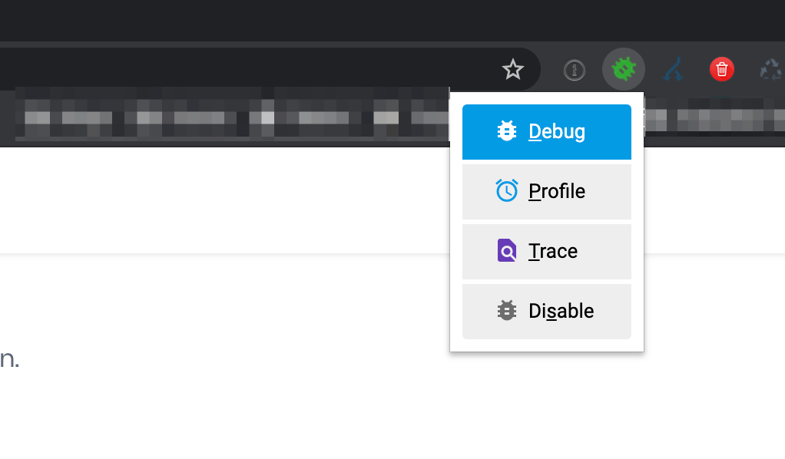

# Debugging

We love rock solid debugging tools and so do you!  
  
XDebug is by far one of the most important debugging tools for PHP developers out there.  
That's why our dockware \#dev images come with a plug'n'play solution out of the box.  
  
All you need is the recommended Chrome Extension for XDebug.  
  
Download the extension here:  
[https://chrome.google.com/webstore/detail/xdebug-helper/eadndfjplgieldjbigjakmdgkmoaaaoc?hl=en](https://chrome.google.com/webstore/detail/xdebug-helper/eadndfjplgieldjbigjakmdgkmoaaaoc?hl=en)  
  
As soon as you start your dockware container with the environment variable **XDEBUG\_ENABLED=1**, you're ready to go.  
This environment variable helps you to turn ON or OFF XDebug in case you want to switch over to a production similar environment for some tests.

```yaml
shopware:
      image: dockware/dev:latest
      ...
      environment:
         - XDEBUG_ENABLED=1 // 1|0 for ON|OFF
```

**Enable Xdebug in your client**

**Eanble Xdebug in Chrome**

Enable Xdebug in your chrome extension by clicking on the option "Debug".  
Now start your XDebug listener in your IDE and start debugging.



**Eanble Xdebug in API clients**

You might want to debug your API requests or other requets in clients without the Xdebug Helper Tool. In this case you can simply append _`XDEBUG_SESSION_START=PHPSTORM`_ as a get parameter to your Url and it will also debug this request.

**Toggling Xdebug**


As Xdebug will slow down your dev environment for every request and also for each command like "cache:clear, watch-storefront" etc. You might not wan't to enable it all the time. For this we have built another useful command.


In our global makefile in /var/www we provide the commands for instantly enabling and disabling Xdebug.  


**Configuration**

We do also have additional environment variables, that you can use for further configuration.  
Please see our section about [Environment Variables](environment-variables.md) for more.


**XDEBUG and LINUX**  
Both MAC and Windows have the Docker variable "host.docker.internal" as default value, which should work great as Loopback IP to automatically recognize the host IP.  
  
For Linux however this does not work! Please use **172.17.0.1** this as ENV variable to make it work!


