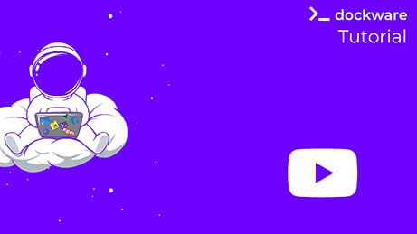

# Getting Started

If you bring your own Shopware source code, you can either use this single image, or (of course) use the dockware/web container and additional containers for MySQL and more.

The benefit with this image is, that it brings a full environment for Shopware, in a single image.

```bash
docker run --rm -p 80:80 dockware/shopware-essentials:latest
```

**Run Shopware 6 with another PHP version**

You can of course use different features such as PHP version switching, Node version switching and more.&#x20;

```bash
docker run --rm -p 80:80 --env PHP_VERSION=8.3 dockware/shopware:latest
```


If you are looking for passwords and default credentials of Shopware and dockware, please take a look at this page: [Default Credentials](default-credentials.md)





<br>
