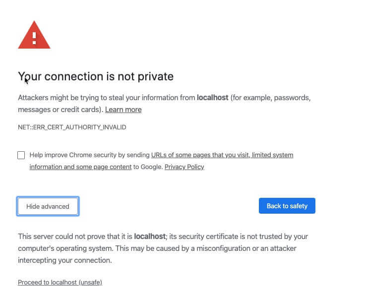
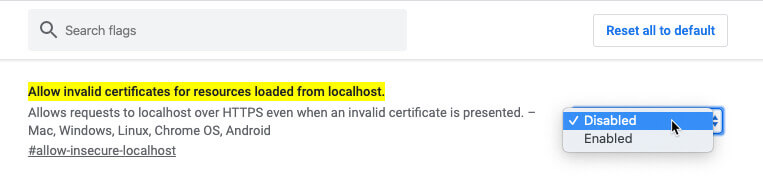

# Chrome Problems

> **Google Chrome shows "Your connection is not private"**
>
> This can happen if you use localhost in combination with https. Please open this URL in your Chrome Browser to access the chrome settings:  
>   
> _\*\*_[chrome://flags/\#allow-insecure-localhost](chrome://flags/#allow-insecure-localhost)  
>   
> Then set `"Allow invalid certificates for resources loaded from localhost."` to be enabled.


If Google Chrome don't show you the "Proceed to ... \(unsafe\) link, you can just type "thisisunsecure" and chrome will go ahead.  
Just focus the chrome main window with the mouse, and start typing, you won't see any input, but it will work.


