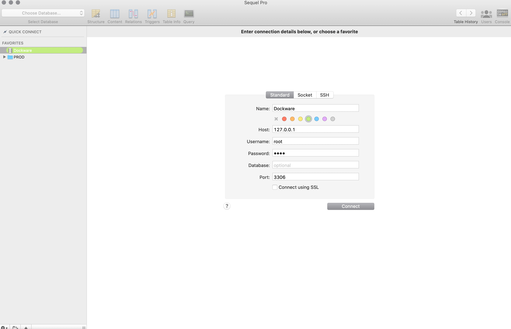

# Sequel Pro

**How to use Sequel Pro?**

You can use Sequel Pro or any other MySQL client to access the Shopware database.

To connect to MySQL from outside your docker container, make sure to expose the port 3306 and make it accessible by hour host.

This can either be done by providing a port when using "docker run -p 3306:3306" or within the "ports" section of your docker-compose.yml.

Please note, you don't need to use 3306 on your host, you can use any free port like 3300:3306, but keep in mind to use that one when connecting from Sequel Pro.

