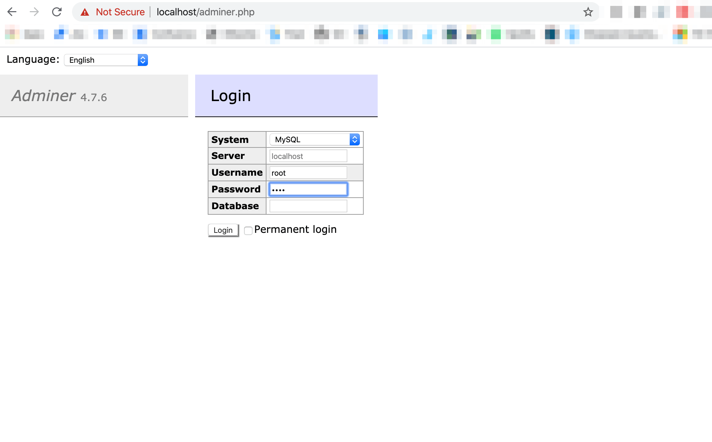
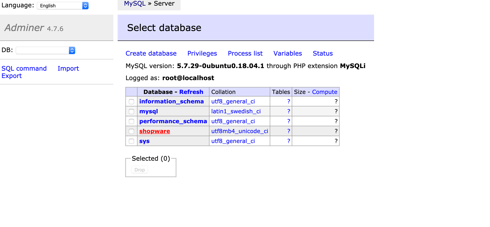
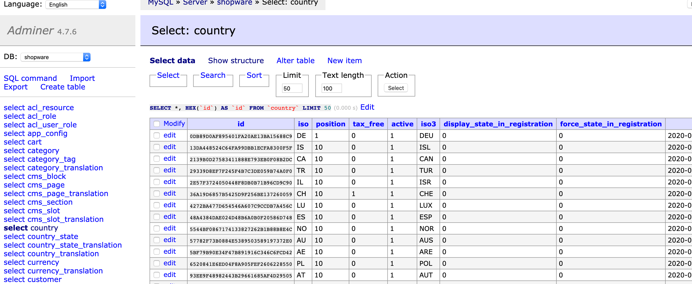

# Adminer

We know that it's very important to access your database when exploring Shopware 6. And that should be possible in an easy and convenient way.

That's why dockware comes with an installed version of Adminer, the Shopware 6 preferred MySQL client.

Open Adminer in your web browser with the following URL:  
  
_/adminer.php_

Now select the database you want to explore. The default database of dockware is called "shopware".

Alright, you do now have access to all tables of the database. You might become a bit familiar with Adminer. Select a table, then click on "Select data" and you should see some rows.

