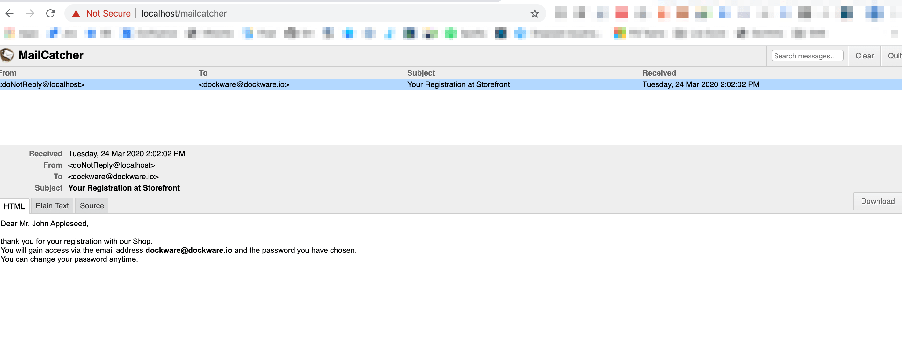

# Mailcatcher

E-Mails are always a "special" challenge when speaking about setups :) They should just work, they should not be sent out accidentally and you don't really want to configure anything just to explore Shopware 6, right?!

Dockware has a built-in Mailcatcher installed. That one is already configured for E-Mails that are being sent out either through Shopware or directly with PHP.

But wait! What's Mailcatcher?

Mailcatcher is a web application that acts as a mail server. The interesting thing is, it receives your email but doesn't send it out to the recipient! Instead of this, it shows you the mail in its mailbox so you can review it and see how it would look like.

Open Mailcatcher in your web browser with the following URL:\
_/mailcatcher_\
__\
__Here you can see the Mailcatcher inbox.\
As soon as emails are sent out, you see them right here!\
\
Please note, in case it's not auto-refreshing, just refresh the page manually.\
\
The Mailcatcher mail server settings can be found [here](../use-dockware/default-credentials.md)

