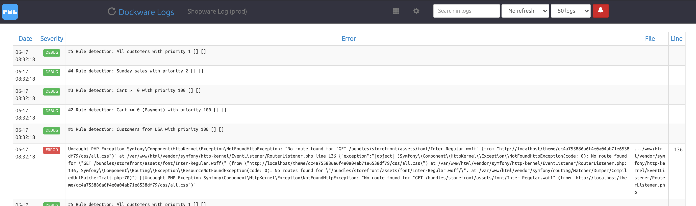

# Pimp my Log

Logs are very important.\
And we know about the frustration when not being able to access it easily.\
And that's why every dockware images comes with an installed [Pimp my Log](https://www.pimpmylog.com) log viewer.

Open the log viewer in your web browser with **/logs** of the domain you use:


[http://localhost/logs](http://localhost/logs)




Switch between different prepared logs, such as Apache error logs, access logs as well as Shopware logs for either production or development.


### Logging with Apps

Logging is far more interesting when it comes to decentralized systems, such as with the ones you'll be building when creating [Shopware Apps](../development/app-development.md).

If you are not logging using [Filebeats](filebeat.md) and an ELK system (Elastic - Logstash - Kibana), then you are probably in the need of seing your log files from your backend service.

This can easily be done with the built-in Pimp my Log application of your Shopware container. Please keep in mind, this is only an easy approach to reuse that application. We still recommend a dedicated container and setup for perfect logging across different containers.

Sending your logs from your backend service to your Shopware container is easy. We can just use bind-mounting for that log folder. So we get the log folder onto our host machine _(step 1)_, and then pass that on to the Shopware container by bind-mounting it to any folder inside that container _(step 2)_. Please use an empty directory somewhere in the Shopware container.

If you do not want to use the local host with bind-mounting, you can also use simple volume mounting or anything else. Just make sure that folder is connected to both containers.

```yaml
version: "3.0"

services:
    
    shop:
       image: dockware/dev:latest
       volumes:
          # step 2: add log folder to container from host
          - "./src/service_logs:/var/www/logs/backend_service"
          # step 3: add pimp my log configuration for new folder
          - "./pimpmylog/service.json:/var/www/pimpmylog/config.user.d/service.json"
       
    service:
       image: dockware/flex:latest
       volumes:
          # step 1: get container log folder on host
          - "./service_logs:/var/www/html/my_used_log_folder"
          
volumes:
    volume_logs:
       external: false
```

Now you have successfully connected the logs from the backend service with the folder inside your Shopware container.

The next thing is, to correctly configured our additional **configuration JSON** for Pimp my Log, which is already mounted into the Shopware container too (_step 3_).

```json
{
    "backend_service": {
        "display"   : "Backend Service Logs",
        "path"      : "/var/www/logs/backend_service/*.log",
        "notify": false,
        "format"    : {
            "multiline": "",
            "regex"    : "@\\[(.*?)\\]\\s*?\\w*\\.(.*?):\\s?((.*?)\\s*?(?:at|in)\\s*?(.*?)\\s*?(?:on line|line)\\s*([0-9]*).*?|(.*?))$@",
            "match"    : {
                "Date"     : 1,
                "Severity" : 2,
                "Error"    : [3,4],
                "File"     : 5,
                "Line"     : 6
            },
            "types"    : {
                "Date"     : "date:m-d H:i:s",
                "Severity" : "badge:severity",
                "File"     : "pre:\/-69",
                "Line"     : "numeral",
                "Error"    : "pre"
            }
        }
    }
}
```


That's it!&#x20;

If you now start your containers, you should already see a filter "**Backend Service Log**s" in Pimp my Log, and logs should be visible, if existing.

