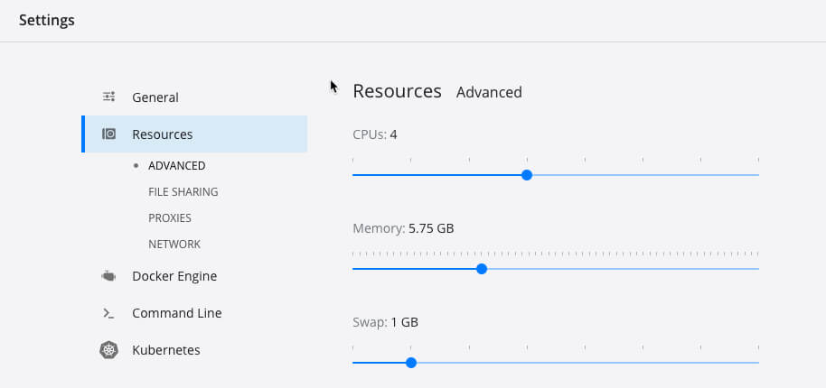

# Performance Tweaks

To improve the performance of your overall docker system, you might want to tweak a few things. We do this by opening our docker preferences on our host machine.

Please note, these are no must-haves, but still help give you a better overall experience of your docker system.

Linux based users need to configure it using the bash, if even needed for their systems.

**Resources**

We start by configuring the amount of CPUs and Memory Docker will get from your host system. This obviously depends on your system and its resources.

When changing these numbers, please keep in mind that the more resources you give Docker, the less your host system has.

We had the best experience by using half of the CPUs \(3-4\) and about 6-8 GBM RAM for Docker.

