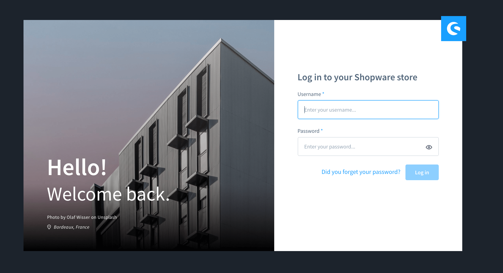
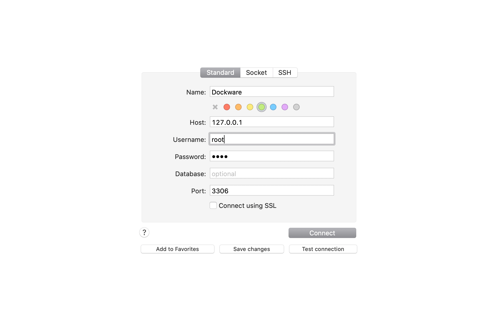
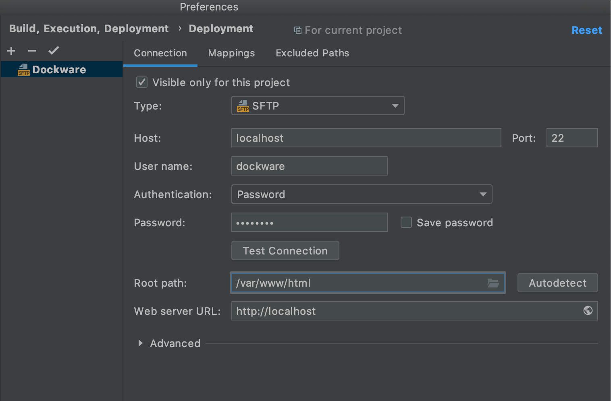
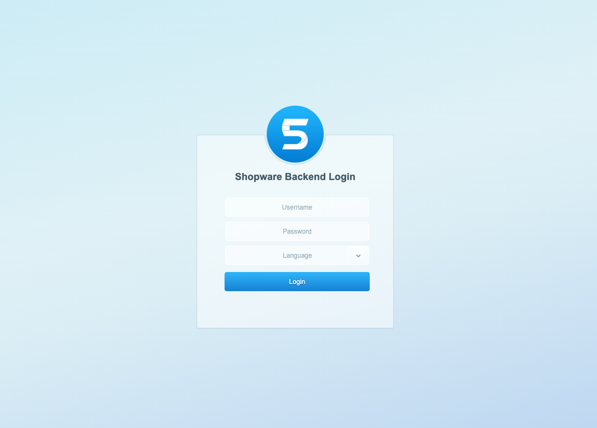

# Default Credentials
- [Default Credentials](#default-credentials)
    * [Shopware 6 Admin](#what-are-the-default-shopware-6-admin-credentials-)
    * [dockware MySQL](#what-are-the-default-dockware-mysql-credentials-)
    * [dockware SSH/SFTP](#what-are-the-default-dockware-ssh-sftp-credentials-)
    * [dockware Mailcatcher](#what-are-the-default-dockware-mailcatcher-settings-)
    * [Shopware 5 Backend](#what-are-the-default-shopware-5-backend-credentials-)

## What are the default Shopware 6 Admin credentials?

User: **admin**\
Password: **shopware**

## What are the default dockware MySQL credentials?

User: **root**\
Password: **root**\
Port: **3306**\
\
Please note, that you need to make the port available to your host machine.

## What are the default dockware SSH/SFTP credentials?

User: **dockware**\
Password: **dockware**\
Port: **22**\
\
Please note, that you need to make the port available to your host machine.

## What are the default dockware Mailcatcher settings?

Host: **localhost**\
Port: **1025**

## What are the default Shopware 5 Backend credentials?

User: **demo**\
Password: **demo**

