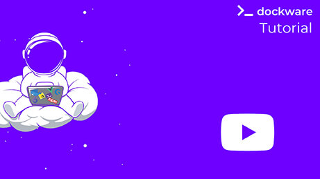

# First Run

It's finally time to start your first Shopware 6 with dockware.  
For this we use the **dockware \#play** version, which brings everything you need to simply start and explore Shopware 6.  
  
**Run Shopware 6 with the latest version**

```bash
docker run --rm -p 80:80 dockware/play:latest
```

The dockware image will be downloaded the first time you run this command. Upcoming starts will not download it again, and will be much faster.

As soon as dockware is ready, you will see an output that shows you all available URLs.

That's it - give it a try!

```bash
** DOCKWARE IMAGE: play
** Tag: 6.3.4.1
** Version: 1.3.5-beta
** Built: Tue Jan  5 13:17:36 UTC 2021
** Copyright 2020 dasistweb GmbH
*******************************************************

launching dockware...please wait...

DOCKWARE: setting timezone to Europe/Berlin...

Current default time zone: 'Europe/Berlin'
Local time is now:      Fri Jan 29 07:39:40 CET 2021.
Universal Time is now:  Fri Jan 29 06:39:40 UTC 2021.

-----------------------------------------------------------
DOCKWARE: starting MySQL....
 * Starting MySQL database server mysqld
   ...done.
-----------------------------------------------------------
DOCKWARE: starting mailcatcher....
Starting MailCatcher
==> smtp://0.0.0.0:1025
==> http://0.0.0.0:1080/
*** MailCatcher runs as a daemon by default. Go to the web interface to quit.
-----------------------------------------------------------
DOCKWARE: starting cron service....
 * Starting periodic command scheduler cron
   ...done.
-----------------------------------------------------------
DOCKWARE: switching to PHP 7.4...
-----------------------------------------------------------
DOCKWARE: testing and starting Apache...
Syntax OK
 * Restarting Apache httpd web server apache2
   ...done.
-----------------------------------------------------------

WOHOOO, dockware/play:6.3.4.1 IS READY :) - let's get started
-----------------------------------------------------
DOCKWARE CHANGELOG: /var/www/CHANGELOG.md
PHP: PHP 7.4.13 (cli) (built: Nov 28 2020 06:24:43) ( NTS )
Apache DocRoot: /var/www/html/public
ADMINER URL: http://localhost/adminer.php
MAILCATCHER URL: http://localhost/mailcatcher
PIMPMYLOG URL: http://localhost/logs
SHOP URL: http://localhost
ADMIN URL: http://localhost/admin

What's new in this version? see the changelog for further details
https://www.shopware.com/de/changelog/

```


Attention! If you use a https connection and chrome as browser, it might block your connection to https://localhost.  
This can be easily changed by following [these steps](../faq/chrome-problems.md) from our FAQ.


There are also other ways to start a Shopware 6 shop.

**Run Shopware 6 with specific version**

```bash
docker run --rm -p 80:80 dockware/play:6.1.3
```

**Run Shopware 6 with another PHP version**

```bash
docker run --rm -p 80:80 --env PHP_VERSION=7.2 dockware/play:latest
```

### Tutorial Video available

Watch our short video about starting and exploring  [Shopware 6 with dockware.](https://youtu.be/2gb8KHdGI6s) 

  


